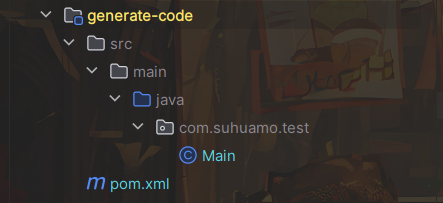
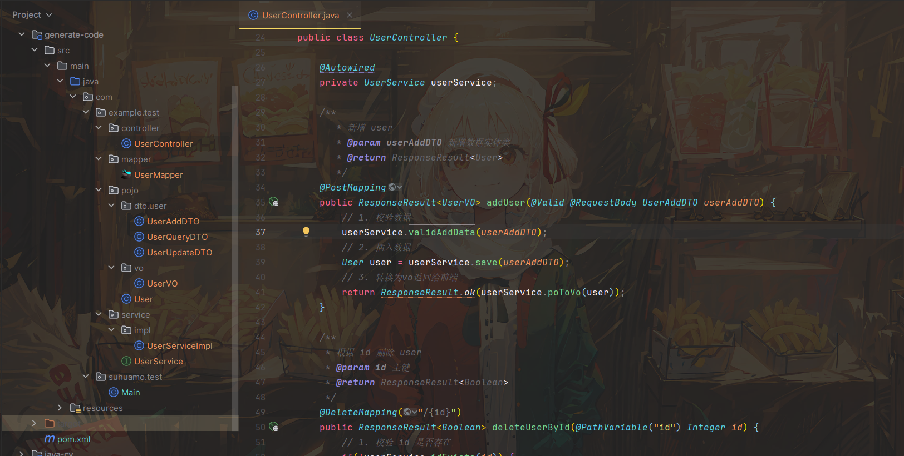
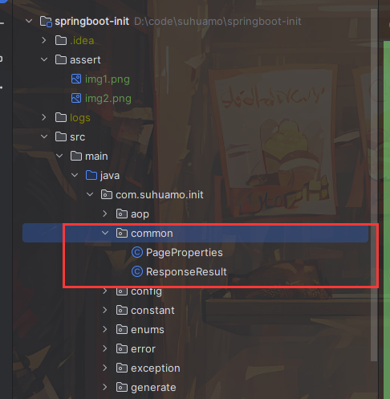
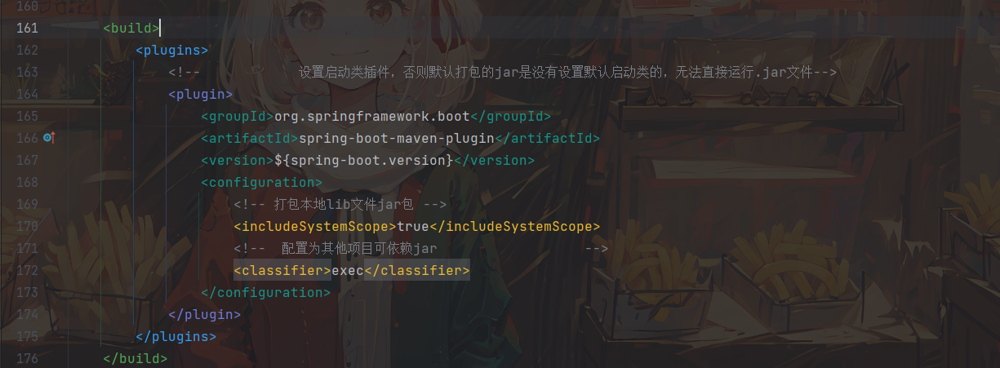

# springboot-init 

## 介绍
1. 对应一个web项目的开发，数据库实体类的生成，controller的增删改查接口每次都需要重复的创建，这样是十分麻烦且没有必要的。因此本项目上线，提供了一套基础的自动生成代码，包含了实体类的生成，controller接口的增删改查生成等。
1. 同时一些基础的功能也是比较常用的，如Jwt鉴权，跨域配置、统一异常处理等，该项目同样接入了这些功能，十分简单即可完成这些模块。

# 使用教程
## 一、只用于生成CRUD代码
### 1. 创建一个空的maven项目
### 2. 在pom.xml中配置依赖
```xml
<!--生成CRUD代码依赖-->
 <dependency>
    <groupId>com.suhuamo</groupId>
    <artifactId>springboot-init</artifactId>
    <version>1.0</version>
</dependency>
```
### 3. 创建运行类，配置参数然后运行
```java
package com.suhuamo.test;

import com.suhuamo.init.generate.GenerateProperties;
import com.suhuamo.init.generate.GenerateUtil;

import java.util.Arrays;

/**
 * @author suhuamo
 * @slogan 巨人给你鞠躬，是为了让阳光也照射到你。
 * @date 2023-12-27
 * @description
 */
public class Main {
    public static void main(String[] args) {
        GenerateProperties generateProperties = new GenerateProperties();
//        数据库地址配置
        generateProperties.setUrl("jdbc:mysql://localhost:3306/springboot-init?userUnicode=true&characterEncoding=utf8&serverTimezone=UTC&nullCatalogMeansCurrent=true");
//        数据库账号
        generateProperties.setUsername("root");
//        数据库密码
        generateProperties.setPassword("123456");
//        生成代码的存放地址的包名
        generateProperties.setParent("com.example.test");
//        需要生成代码的表名
        generateProperties.setTables(Arrays.asList(new String[]{"t_user"}));
//        生成的PO对象需要忽略的前缀
        generateProperties.setTablePrefix(Arrays.asList(new String[]{"t_"}));
//        执行生成代码方法
        GenerateUtil.generatorCode(generateProperties);
    }
}
```
### 4.数据库结构：


*提示*：数据库的结构在 `springboot-init`项目的 `resources`目录的 `sql` 文件夹中，运行 `init.sql`即可
### 5.点击运行`Main`文件即可生成代码
#### 1.生成前结构

#### 2.生成后结构


### 注意：如果要将生成的代码粘贴到新项目中（没有引用`springboot-init` 依赖的项目），那么要将`springboot-init` 项目中的 `com.suhuamo.init.common` 目录复制到新项目中，否则会报错【`com.suhuamo.init.common.PageProperties/ResponseResult`类找不到】。



## 二、用于生成CRUD代码并且作为基础项目使用
### 1. 下载代码
```shell
git clone https://gitee.com/suhuamo/springboot-init.git
```
### 2. 生成CRUD代码
操作和第一种一样，只不过不需要修改依赖了，项目拉下来了之后直接运行`src/test/java/com/suhuamo/init/ApplicationMainTest.java`文件生成代码即可。【需要修改为自己的数据库和表名】

### 3. 修改项目的基础配置 
#### 1.`application.yml`配置
- `mysql` 配置：在 `spring.datasource` 配置数据库名称、账号、密码
- `mybatis` 配置：在`mybatis-plus` 配置xml文件映射位置、表名前缀、逻辑删除字段、实体类位置
- `springdoc` 配置：在`knife4j` 配置`controller`包路径
#### 2. `java`配置类
- `jwt` 配置： 在`com.suhuamo.init.config.JwtWebConfig` 类中配置拦截的接口和放行的接口。【该配置默认是不生效的，需要将该配置类上的注解`@Configuration` 取消注释才可生效】
- `跨域`配置：在`com.suhuamo.init.config.CorsConfig` 类中配置允许跨域的ip、方法、请求头、是否携带cookie等。
- `文件`配置：在`com.suhuamo.init.config.WebConfig`类中配置虚拟路径映射地址和 `project.file` 中配置本地文件的下载地址
### 4. 配置至此完成，接下来正常流程开发即可
### 5. 功能讲解
#### 1. 项目启动日志
项目启动时会打印项目的`后端API接口地址`和`springdoc的地址`，如下：

#### 2. 跨域配置
在 `CorsConfig` 配置类中需要配置运行跨域访问的ip，否则前后端分离时前端项目是无法访问后端项目接口的，会报错 `403` 码
#### 3. Jwt配置
`token` 认证配置，在 `JwtWebConfig` 配置类中可配置哪些接口不需要认证也可访问，而其他的所有接口都需要通过请求中请求头携带`token`才可访问，而`token`是在`UserController`的`login`接口获得的
#### 4. 文件配置
类似上传图片等功能是需要将用户上传的文件存放在本地的，故需要配置本地的某个文件夹路径来存放这些文件，而前端需要将这些文件回显回来，那么后端也需要将本地的这个文件夹目录映射到服务中，使得其他终端也能访问到本机服务的图片，这个时候就需要配置虚拟路径映射了。
# 注意
    由于配置了该插件`classifier`，那么打包之后，运行的jar包是 `springboot-init-1.0-exec.jar`,而不是 `springboot-init-1.0.jar`。因为配置了这个插件之后，自动生成的`springboot-init-1.0.jar`是不含任何依赖的，只有该项目的源代码，故可以被其他项目引用，而`springboot-init-1.0-exec.jar`是含有所有依赖的，可以直接运行。
